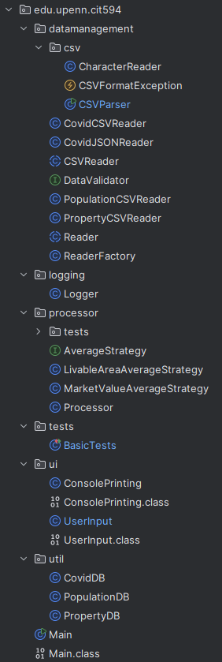

<!-- Improved compatibility of back to top link: See: https://github.com/othneildrew/Best-README-Template/pull/73 -->
<a id="readme-top"></a>
<!--
*** Thanks for checking out the Best-README-Template. If you have a suggestion
*** that would make this better, please fork the repo and create a pull request
*** or simply open an issue with the tag "enhancement".
*** Don't forget to give the project a star!
*** Thanks again! Now go create something AMAZING! :D
-->


<!-- PROJECT SHIELDS -->
<!--
*** I'm using markdown "reference style" links for readability.
*** Reference links are enclosed in brackets [ ] instead of parentheses ( ).
*** See the bottom of this document for the declaration of the reference variables
*** for contributors-url, forks-url, etc. This is an optional, concise syntax you may use.
*** https://www.markdownguide.org/basic-syntax/#reference-style-links
-->
<!-- [![Contributors][contributors-shield]][contributors-url]
[![Forks][forks-shield]][forks-url]
[![Stargazers][stars-shield]][stars-url]
[![Issues][issues-shield]][issues-url]
[![project_license][license-shield]][license-url]
[![LinkedIn][linkedin-shield]][linkedin-url]
-->


<!-- PROJECT LOGO -->
<br />
<div align="center">
  <a href="https://github.com/jwbmarten/PixelSolitaireREDUX">
    
  </a>

<h3 align="center">CovidAnalyzer</h3>

  <p align="center">
    Data Analysis Tool
  </p>
</div>


<!-- ABOUT THE PROJECT -->
## About The Project


CovidAnalyzer is a Java application designed to leverage open source data from the [OpenDataPhilly repository](https://opendataphilly.org/) to examine relationships between property value, population, and Covid-19 within Philadelphia zip codes. CovidAnalyzer parses .csv and .JSON files provided at runtime, and then provides the user with different analysis options depending on which file types (i.e. any possible permutation of Covid, Property Value, and Population files) were provided.

<p align="right">(<a href="#readme-top">back to top</a>)</p>


### Built With

* [![Java][java]][java-url]
* [![JUnit][JUnit]][JUnit-url]


<p align="right">(<a href="#readme-top">back to top</a>)</p>


<!-- GETTING STARTED -->
## Getting Started

### Application Set-up
1. If you do not already have Java installed on your machine, download a recent version from https://www.java.com/en/
2. If you do not already have IntelliJ (or a Java IDE of your choice) on your machine, download the latest free community version from https://www.jetbrains.com/idea/download/
3. Clone the repo
   ```sh
   git clone https://github.com/jwbmarten/CovidAnalyzer
   ```
4. Ensure the json-simple .jar dependency is included in compilation scope - this .jar is included in the project files. 

<figure style="text-align: center;">
    
</figure>


5.  If you do not already have JUnit installed on your machine, download the latest version from https://junit.org/junit5/ and add to PATH, OR remove the test classes from the project.

### Data Files

CovidAnalyzer works with 3 different types of data: Population, Properties, and Covid. These files have already been provided at can be found in /analysis-project-main. If you would like to add your own, they can be found by visiting the [OpenDataPhilly repository](https://opendataphilly.org/). Once downloaded, simply add to them to the project files in the same location. Please note however, that the file format may change over time and it is a good idea to compare the provided files to whichever files you wish to interrogate. 

<figure style="text-align: center;">
    
</figure>


<p align="right">(<a href="#readme-top">back to top</a>)</p>

## Application Inputs

### Application arguments - Data

Files should be provided at runtime by specifying data-type and filenames. Each file input should be in the form: --datatype=filename. For instance, you wanted to analyze the provided covid_data.csv, population.csv, and downsampled_properties.csv files, your agruments would be: 
   ```sh
   --covid=covid_data.csv  --population=population.csv  --properties=downsampled_properties.csv
   ```

### Application arguments - Logging

CovidAnalyzer inclues logging functionality which records user input events. A user can provide an existing .log file to append the logs to, or a filename for a new .txt file to be created and written to. If no log file argument is provided at runtime, then the logs will be written to the console as a standard error (this will not affect the program in any way, but simply print the logs in red so they are distinguished from regular program output). 

   ```sh
   --covid=covid_data.csv  --population=population.csv  --properties=downsampled_properties.csv  --log=existingOrNewFilename.log
   ```

## Running the Application

CovidAnalyzer can be run from the command line, or using an IDE run configuration. 

### Running from the command line

To run CovidAnalyzer from the command line, navigate to the src folder and enter the following:
   ```sh
   java edu.upenn.cit594.Main --arguments
   ```

### Running from IDE Run Configuration (recommended)

Open your IDE run configurations and add a new configuration ensuring the Working Directory path is correct for your machine's copy of CovidAnalyzer and the files you wish to analyze are provided in the arguments:

<figure style="text-align: center;">
    
</figure>

### Using the Application

Upon start, CovidAnalyzer will load, parse, and store the data from the provided files and display the main menu.

<figure style="text-align: center;">
    
</figure>

Note that if you have not provided one of each data type, not all actions will be available to you. To view your possible actions, select menu option 1.

<figure style="text-align: center;">
    
</figure>

<p align="right">(<a href="#readme-top">back to top</a>)</p>


## Application Design

CovidAnalyzer was designed using an N-tier architecture, with each tier corresponding to a specific function. It also utilizes a strategy design pattern for similar but distinguished analyses, such as the Livable Area vs Market Value strategy classes in the processor package. 

CovidAnalyzer was also built using JUnit to perform unit testing. These tests can be found in the tests package as well as in the processor package.

<figure style="text-align: center;">
    
</figure>


<!-- ACKNOWLEDGMENTS -->
## Acknowledgments

* [OpenDataPhilly repository](https://opendataphilly.org/)

<p align="right">(<a href="#readme-top">back to top</a>)</p>


<!-- MARKDOWN LINKS & IMAGES -->
<!-- https://www.markdownguide.org/basic-syntax/#reference-style-links -->
[JUnit]: https://img.shields.io/badge/JUnit-e74a45?style=for-the-badge&logo=junit5&logoColor=000000
[JUnit-url]:https://junit.org/junit5/
[java]: https://img.shields.io/badge/JAVA-cornflowerblue?style=for-the-badge&logo=coffeescript&logoColor=
[java-url]: https://www.java.com/en/
[aseprite]: https://img.shields.io/badge/aseprite-7B68EE?style=for-the-badge&logo=aseprite&logoColor=FFFFF0
[aseprite-url]: https://www.aseprite.org/
[contributors-shield]: https://img.shields.io/github/contributors/github_username/repo_name.svg?style=for-the-badge
[androidStudio]: https://img.shields.io/badge/Android%20Studio-3DDC84?style=for-the-badge&logo=android-studio&logoColor=white
[androidStudio-url]: https://developer.android.com/studio
[contributors-url]: https://github.com/github_username/repo_name/graphs/contributors
[forks-shield]: https://img.shields.io/github/forks/github_username/repo_name.svg?style=for-the-badge
[forks-url]: https://github.com/github_username/repo_name/network/members
[stars-shield]: https://img.shields.io/github/stars/github_username/repo_name.svg?style=for-the-badge
[stars-url]: https://github.com/github_username/repo_name/stargazers
[issues-shield]: https://img.shields.io/github/issues/github_username/repo_name.svg?style=for-the-badge
[issues-url]: https://github.com/github_username/repo_name/issues
[license-shield]: https://img.shields.io/github/license/github_username/repo_name.svg?style=for-the-badge
[license-url]: https://github.com/github_username/repo_name/blob/master/LICENSE.txt
[linkedin-shield]: https://img.shields.io/badge/-LinkedIn-black.svg?style=for-the-badge&logo=linkedin&colorB=555
[linkedin-url]: https://linkedin.com/in/linkedin_username
[product-screenshot]: images/screenshot.png
[Next.js]: https://img.shields.io/badge/next.js-000000?style=for-the-badge&logo=nextdotjs&logoColor=white
[Next-url]: https://nextjs.org/
[React.js]: https://img.shields.io/badge/React-20232A?style=for-the-badge&logo=react&logoColor=61DAFB
[React-url]: https://reactjs.org/
[Vue.js]: https://img.shields.io/badge/Vue.js-35495E?style=for-the-badge&logo=vuedotjs&logoColor=4FC08D
[Vue-url]: https://vuejs.org/
[Angular.io]: https://img.shields.io/badge/Angular-DD0031?style=for-the-badge&logo=angular&logoColor=white
[Angular-url]: https://angular.io/
[Svelte.dev]: https://img.shields.io/badge/Svelte-4A4A55?style=for-the-badge&logo=svelte&logoColor=FF3E00
[Svelte-url]: https://svelte.dev/
[Laravel.com]: https://img.shields.io/badge/Laravel-FF2D20?style=for-the-badge&logo=laravel&logoColor=white
[Laravel-url]: https://laravel.com
[Bootstrap.com]: https://img.shields.io/badge/Bootstrap-563D7C?style=for-the-badge&logo=bootstrap&logoColor=white
[Bootstrap-url]: https://getbootstrap.com
[JQuery.com]: https://img.shields.io/badge/jQuery-0769AD?style=for-the-badge&logo=jquery&logoColor=white
[JQuery-url]: https://jquery.com 
